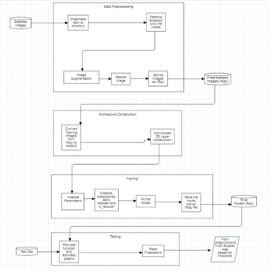
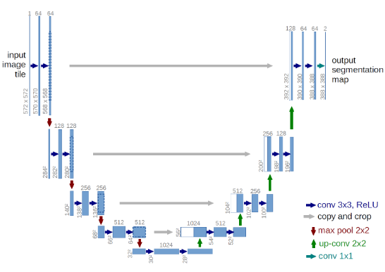

# Road-Segmentation using U-NET

## Abstract

We present a technique performing satellite image segmentation by separating roads from what we call background, representing anything but roads. Among multiplemethods, we choose the current most powerful one for the task, a particular type of convolutional neural network which has already been adopted for biomedical imagesegmentation in the past. The final model consists in training such a neural network from cropped and augmented satellite images along with ground truth road labels, achieving a pixel wise prediction.

## Modules

1. Data Preprocessing
2. Training the model
3. Testing model

## Block Diagram

## Model Architecture

## Packages

- Numpy
- Pandas
- Matplotlib
- Scikit Learn
- Tensorflow
- Keras
- Open CV
- H5PY
- OS
